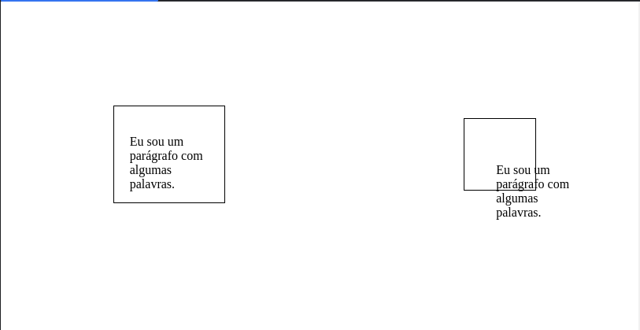
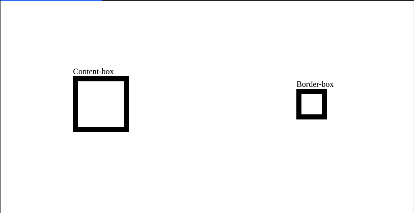

## Resumo
### Tamanho implítico vs Tamanho explícito

Os elementos inseridos em uma página HTML são representados através de blocos
e esses blocos podem ou não ter conteúdos dentro, e a forma como nós definimos o tamanho
impacta diretamente na visualização dos elementos.

Ex: Temos uma caixa que contém um parágrafo.

Caso não dissermos via CSS o tamanho dessa caixa ela irá expandir para que todo o conteúdo
fique dentro da respectiva caixa, isso é conhecído como "intrinsic sizing" onde deixamos para o Browser e suas respectivas
configurações decidirem como esse elemento deve ser posicionado, considerando que estamos numa situação "esperada" a caixa irá expandir
até conseguir abrigar o conteúdo.

Caso dissermos via CSS o tamanho dessa caixa e caso o texto seja maior do que a caixa, o texto irá "transbordar" a caixa, apesar de ainda fazer parte dela.

### Content-box vs Border-box

Existem duas configurações sobre como as caixas devem se comportar em relação ao _padding_ e _margin_ inseridos via CSS.

E de acordo com a configuração escolhida irá influenciar diretamente no tamanho final do objeto, sendo eles: 

**Content-box**
Onde as informações de _margin_ e _padding_ serão somados ao tamanho da caixa e assim no final a caixa irá crescer.

**Border-box**
O tamanho da caixa permanecerá fixo independente da quantidade de _padding_ e _margin_ inseridos, no entanto, não existe uma soma-zero aqui, nem mágica, esse valor
será diminuído do conteúdo da caixa.

Ex: temos uma caixa e iremos definir um tamanho fixo para essa caixa e inserirmos algumas estilizações de _margin_, _padding_ e _border_.

Apesar das duas caixas terem sidos definidas com o mesmo _width_ elas tem tamanhos diferentes por conta de suas configurações.