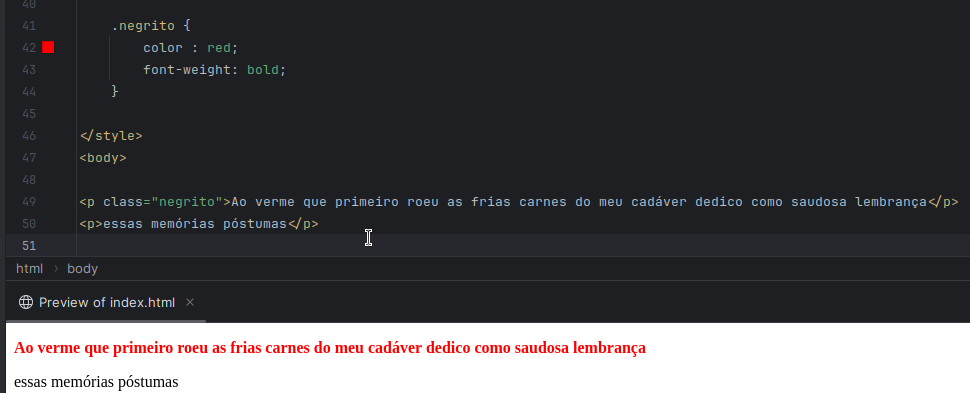

# Conteúdo

1. [Introdução](#introdução)
2. [Seletores de Atributo](#seletores-de-atributo)
3. [Agrupando Seletores](#agrupando-seletores)
4. [Pseudo-elementos e pseudo-classes](#pseudo-elementos-e-pseudo-classes)]
5. [Combinando Seletores](#combinando-seletores)
6. [Conclusão](#conclusão)

### Introdução
Para estilizar os elementos do HTML podemos fazê-lo através do CSS, e podemos fazê-lo através do próprio HTML utilizando o atributo `style` (Não faz isso pfv) ou através de seletores.

> Utilizarmos do `style` diretamente no atributo HTML gera consequências terríveis posteriormente já que ele se sobrepõe a qualquer outra estilização realizada, independente da especificidade.

Dito isso, a melhor forma de estilizarmos é através dos seletores e dá pra dizer que temos uma forma para cada situação que você precise, abaixo veremos algumas delas.

**Elementos(_tags_)**: Podemos selecionar elementos HTML através das suas próprias tags, para isso podemos colocar apenas o nome do elemento que queremos estilizá-lo e irá funcionar.

**Classes**: Através da classes podemos criar um conjunto de estilizações e replicá-las em qualquer elemento que contenha essa classe, para selecionar a classe precisamos inserir `.` antes do nome da classe.

**IDs**: Onde podemos criar um conjunto de estilizações para um único elemento, visto que não podemos ter mais um elemento com o mesmo ID, para selecionarmos um elemento com esse ID precisamos inserir o `#` antes
do nome do ID.

### Seletores de atributo

Essas três formas que vimos anteriormente são as mais simples e as que aprendemos primeiro quando estamos estudando o CSS, no entanto, como havia dito, realmente podemos ter cenários em que não queremos aplicar aquela estilização para todos os elementos com aquela classe
talvez apenas para o primeiro, ou para o último, ou somente para aquele que atingiu `XPTO` condição.

Ex: quero selecionar apenas o elemento que tenha um atributo muito específico chamado `data-type`.

Quando digo que podemos selecionar qualquer elemento que contenha `XPTO` atributo, é realmente qualquer atributo.

> **IMPORTANTE**: Apesar de podermos selecionar qualquer atributo, é importante criar algo que tenha uma semântica, isso é, o atributo por si só consegue dizer para qual propósito ele foi inserido.
> Ex: `data-type`, `event-trigger` e etc.

Mas podemos ser ainda mais específicos sobre nossos seletores, podendo até mesmo selecionar pelo conteúdo que o atributo possui.

Ex: quero selecionar apenas o elemento que tenha o atributo `data-type` mas que ele tenha como valor a palavra `shazam`

Apenas precisamos acrescentar o `=` e após isso inserir a _string_ ao qual esse elemento precisa ter.

**Bônus**: também podemos ativar o _case-sensitive_ ou case-insensitive, isso é, diferenciarmos letras máiusculas de minúsculas ou não, respectivamente.

**Case sensitive:**

**Case insensitive:**

> **IMPORTANTE**: Dependendo do navegador do usuário talvez essa funcionalidade não esteja disponível. https://caniuse.com/css-case-insensitive

Mas ainda não é suficiente, precisamos ser mais específicos, quero selecionar somente os elementos que seja um hiperlink e esse hiperlink inicia com `HTTPS://`.

Para isso podemos utilizar alguns _matchers_ para partes de uma string.

Para procurarmos no início do valor do atributo utilizamos do `^`, também conhecido como chapéuzinho, antes do `=`, ficando `^=` como podemos ver abaixo.

Para procurarmos no fim do valor do atributo utilizamos do `$`, antes do `=`, ficando `$=`.

E se ainda não foi suficiente podemos procurar por qualquer elemento que contenha `XPTO` como valor do atributo, independente se no começo ou ao final.

Para isso utilizamos do `*`, a famigerada estrelinha, antes do `=`, ficando `*=`.

### Agrupando seletores

Na seção anterior vimos diversas formas de selecionar um elemento, ou elementos que atinjam suas respectivas condições, porém não é incomum nos depararmos
com uma situação onde precisamos aplicar um conjunto de estilizações para elementos distintos, ou que atinjam diferentes condições mas que recebem o mesmo conjunto de estilização.

Para isso podemos agrupar seletores e dar a eles o mesmo conjunto de estilizações, para isso basta separá-los por vírgulas e o CSS fará o restante.

Ex: quero que todos os elementos do tipo `<strong>` e que todos `<b>` e os elementos com a classe `negrito-vermelho` tenham suas cores em vermelho.

### Pseudo-elementos e Pseudo-classes

Além de podermos utilizar dos elementos, classes, ids e atributos também temos outras formas selecionar elementos, aqui veremos como podemos 
selecioná-los através do seu "estado" ou através de partes daquele elemento.

As pseudo-classes se referem a determinados estados que aquele elemento possa ter e se caso essa condição seja atingida o estilo será aplicado,
durante a navegação em uma página HTML podemos acabar disparando algumas ações em determinados elementos, e a situação mais comum é quando passamos o mouse em cima de um determinado elemento
e ao realizarmos essa ação aquele elemento agora passar a estar em um estado de `hover`, em bom português "O mouse está flutuando por cima do elemento", e ao retirarmos o mouse de cima o elemento voltará ao seu estado normal.

E para selecionarmos essas pseudo-classes nós utilizamos do `:` após o elemento.

Ex: Ao passar o mouse por cima do meu elemento quero que a cor de fundo seja alterada.

Ex²: Quero que apenas o último-filho de uma lista tenha a cor vermelha e negrito.

Aqui estamos utilizando a pseudo-classe `nth-last-child` onde ele irá selecionar elementos a partir do último elemento, e pode receber como parâmetro o numero da posição elemento contado de "trás pra frente".

> **Importante**: Há uma quantidade absurda de pseudo-classes que podemos utilizar, o objetivo aqui é apenas saber que elas existem e como podemos utilizá-las, você pode conferir todas através do [MDN](https://developer.mozilla.org/en-US/docs/Web/CSS/Pseudo-classes)

Já os pseudo-elementos tem como diferença que utilizamos de `::`, o dobro das pseudo-classes, e eles não são estados de um elemento como vimos anteriormente,
e sim "elementos" que são adicionados a outros elementos HTML, normalmente antes ou depois.

Ex: Podemos inserir um novo elemento antes do nosso parágrafo diretamente através do CSS.

Ex: Ou também podemos acessar pseudo-elementos já existentes no elemento.

> Importante: Mesma coisa que havia dito anteriormente, existe uma variedade absurda de pseudo-elementos, o objetivo é o mesmo, caso queira conhecer todas você pode sempre consultar o [MDN](https://developer.mozilla.org/pt-BR/docs/Web/CSS/Pseudo-elements)

### Combinando seletores

Seguindo na linha do que estávamos falando, volto a repetir, dá pra se dizer que temos uma forma de selecionar elemento para cada situação que você precise.

Aqui veremos como podemos combinar seletores de forma que qualquer elemento que atinja aquela condição será aplicado o conjunto de estilo que inserimos.

Começando dos mais simples, quero selecionar apenas os elementos `strong` que sejam filhos de um `p`

> **IMPORTANTE**: quando combinamos seletores dessa forma o elemento que será estilizado sempre será o que atingir a condição, não será o elemento pai ou o elemento que faz parte, para ajudar você pode ler da seguinte forma:
> Quero selecionar todos os elementos `strong` que sejam filhos de `p`
> Nesse caso, se eu tivesse um outro elemento `strong` mas que ele fosse filho de um `span` ele não seria selecionado e consequentemente não receberia o conjunto de estilo que definimos.

Um fato curioso sobre esse tipo de seleção é que a busca é recursiva, isso é, para cada elemento filho é feito novamente a verificação se eles atingem a condição inserida e assim consequentemente para cada novo filho dentro desses filhos (_inception_), ou seja, se tivéssemos um outro `p` e dentro dele tivéssemos outro `strong` e assim consecutivamente todos seriam selecionados.

Com o exemplo acima não fica fácil de compreender, mas em um cenário em que precisamos colocar aninhamento em elementos e para isso precisamos colocar uma _margin-left_ em cada elemento filho nós não precisamos criar
uma classe para cada elemento filho com seus respectivos níveis, basta que criemos uma classe inicial e selecionar o elemento dentro dela, ex:

Agora queremos selecionar apenas o primeiro parágrafo que vier logo em seguida após uma imagem, para isso utilizamos do operador `+` quando quisermos procurar qualquer elemento que venha em sequência ao primeiro elemento.

Ex: Selecionando o primeiro `p` após uma `img`, perceba que um `p` não recebeu o estilo por ser precedido por um `p` ao invés uma `img` como inserimos.

Como vimos, o segundo páragrafo não foi aplicado ao estilo, porque o `+` exige que ele seja filho de `img`, no entanto, caso quiséssemos que o `p` também recebesse o estilo precisariamos
alterar o operador para `~` onde agora basta que o parágrafo tenha como parente o elemento `img`.

No estilo anterior temos um problema onde pode acabar que o estilo seja aplicado para todos os elementos `p` que tenham como parente o `img`, no entanto, podemos ser mais restritivos 
e selecionarmos apenas os que sejam filhos diretamente do elemento ao qual desejamos.

Precisarei mudar o exemplo utilizado já que a tag `img` não admite filhos.

### Conclusão

Vimos que há diversas formas de selecionarmos elementos e aplicarmos nossos estilos a eles, e justamente por sua quantidade precisamos memorizá-los 
mas saber que eles existem e que há formas de fazer isso, dessa forma quando for necessário você pode revisitar a documentação e lembrar novamente como faz,
apesar de que com o tempo você acabará memorizando/aprendendo.